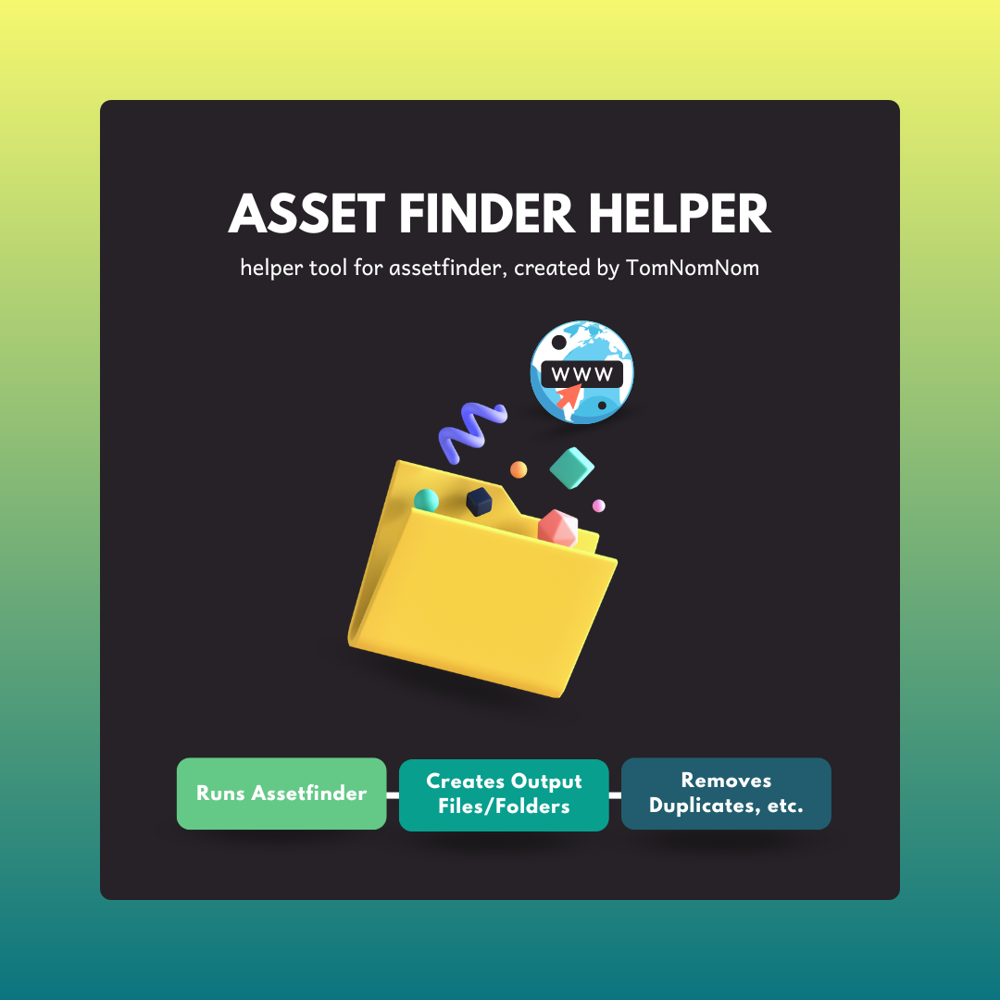

<!-- PROJECT SHIELDS 
[![Contributors][contributors-shield]][contributors-url]
[![Forks][forks-shield]][forks-url]
[![Stargazers][stars-shield]][stars-url]
[![Issues][issues-shield]][issues-url]
[![MIT License][license-shield]][license-url]
[![LinkedIn][linkedin-shield]][linkedin-url]
-->

<!-- PROJECT LOGO -->
 

  <a href="https://github.com/ct-cybersec/asset-finder-helper">
    

<!-- ABOUT THE PROJECT -->
## ABOUT ASSET FINDER HELPER

First, Assetfinder [created by: [TomNomNom](https://github.com/tomnomnom/assetfinder)], itself, is a handy tool that attempts to find domains and/or subdomains related to a specific given domain.

Asset Finder Helper is what the name suggests: it's a way to help automate assetfinder, while placing the results in files & removing duplicates/results that do not contain the URL that is supplied.

Background: This python script is a transformation of the bash script created by Heath Adams in his PNPT course, more specifically the Web Application section, with a few added features and tools, such as:
1. Creating a URL folder that contains the results files
2. Adding a progress bar to the script
3. Adding an option to either delete the original assetfinder results file that contains duplicates and unnecessary results
4. Adding, of course, the kewl graphics & color scheme 😋

NOTE: Only tested on Kali Linux, because I am lazy & honestly created this out of sheer boredom.

(<a href="#readme-top">back to top</a>)

<!-- USAGE EXAMPLES -->
## USAGE
1. Install Python 3
2. Install Assetfinder via [TomNomNom's](https://github.com/tomnomnom/assetfinder) page. Follow the guide on that page for downloading & installing
3. Clone Asset Finder Helper repo: `git clone https://github.com/ct-cybersec/asset-finder-helper` OR copy the raw output of [asset-finder-helper.py](https://raw.githubusercontent.com/ct-cybersec/asset-finder-helper/main/asset-finder-helper.py) to a python file
2. Run the script as such: `python asset-finder-helper.py <URL i.e. ct-cybersec.me>`
3. Script will create or check for URL folder -> create or check for assets folder inside URL folder -> run assetfinder -> create assets.txt with results of assetfinder -> create final.txt with assetfinder results, without duplicates and unnecessary results
4. Option will be given to either keep or delete assets.txt file

  

 

(<a href="#readme-top">back to top</a>)

<!-- LICENSE -->
## LICENSE

Distributed under the MIT License. See `LICENSE.md` for more information.

(<a href="#readme-top">back to top</a>)

<!-- PENTESTING PORTFOLIO SITE -->
## SOCIAL MEDIA & MORE

Corey Thompson - [@ct_cybersec](https://twitter.com/ct_cybersec) 
Pentesting Portfolio Site - [ct-cybersec.me](https://ct-cybersec.me)  

(<a href="#readme-top">back to top</a>)

<!-- MARKDOWN LINKS & IMAGES -->
<!-- https://www.markdownguide.org/basic-syntax/#reference-style-links -->
[contributors-shield]: https://img.shields.io/github/contributors/othneildrew/Best-README-Template.svg?style=for-the-badge
[contributors-url]: https://github.com/ct-cybersec/password-generator/graphs/contributors
[forks-shield]: https://img.shields.io/github/forks/othneildrew/Best-README-Template.svg?style=for-the-badge
[forks-url]: https://github.com/ct-cybersec/password-generator/network/members
[stars-shield]: https://img.shields.io/github/stars/othneildrew/Best-README-Template.svg?style=for-the-badge
[stars-url]: https://github.com/ct-cybersec/password-generator/stargazers
[issues-shield]: https://img.shields.io/github/issues/othneildrew/Best-README-Template.svg?style=for-the-badge
[issues-url]: https://github.com/ct-cybersec/password-generator/issues
[license-shield]: https://img.shields.io/github/license/othneildrew/Best-README-Template.svg?style=for-the-badge
[license-url]: https://github.com/ct-cybersec/password-generator/blob/main/LICENSE
[linkedin-shield]: https://img.shields.io/badge/-LinkedIn-black.svg?style=for-the-badge&logo=linkedin&colorB=555
[linkedin-url]: https://www.linkedin.com/in/coreythompson42/
[product-screenshot]: images/asset-finder-help-gif.gif
[Next.js]: https://img.shields.io/badge/next.js-000000?style=for-the-badge&logo=nextdotjs&logoColor=white
[Next-url]: https://nextjs.org/
[React.js]: https://img.shields.io/badge/React-20232A?style=for-the-badge&logo=react&logoColor=61DAFB
[React-url]: https://reactjs.org/
[Vue.js]: https://img.shields.io/badge/Vue.js-35495E?style=for-the-badge&logo=vuedotjs&logoColor=4FC08D
[Vue-url]: https://vuejs.org/
[Angular.io]: https://img.shields.io/badge/Angular-DD0031?style=for-the-badge&logo=angular&logoColor=white
[Angular-url]: https://angular.io/
[Svelte.dev]: https://img.shields.io/badge/Svelte-4A4A55?style=for-the-badge&logo=svelte&logoColor=FF3E00
[Svelte-url]: https://svelte.dev/
[Laravel.com]: https://img.shields.io/badge/Laravel-FF2D20?style=for-the-badge&logo=laravel&logoColor=white
[Laravel-url]: https://laravel.com
[Bootstrap.com]: https://img.shields.io/badge/Bootstrap-563D7C?style=for-the-badge&logo=bootstrap&logoColor=white
[Bootstrap-url]: https://getbootstrap.com
[JQuery.com]: https://img.shields.io/badge/jQuery-0769AD?style=for-the-badge&logo=jquery&logoColor=white
[JQuery-url]: https://jquery.com 
